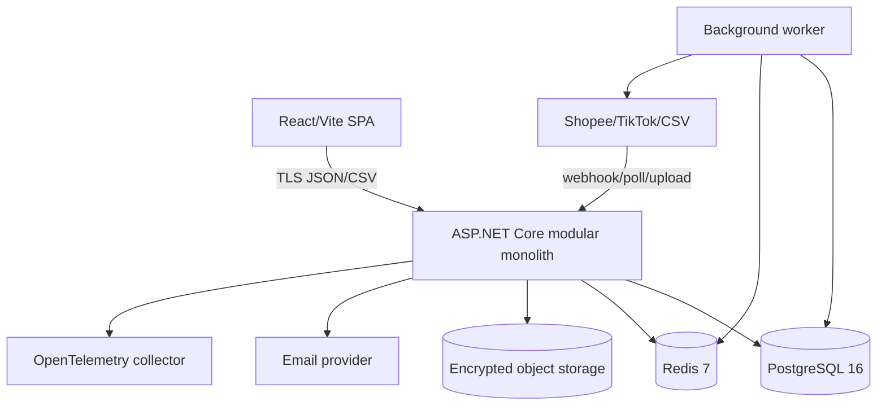
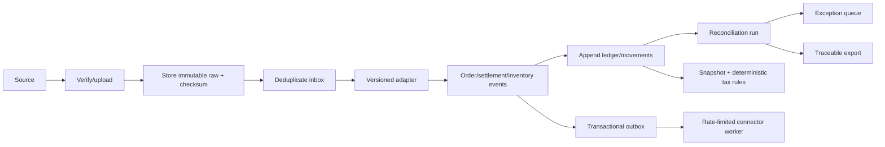
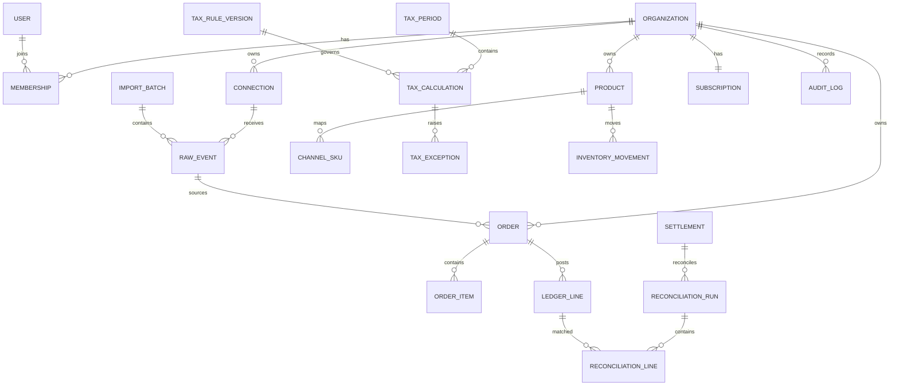

# Architecture, module boundaries and data dictionary

## Context and deployment



MVP deploys API and worker from one codebase but separate processes. PostgreSQL is source of truth; Redis is cache/coordination only. Raw large files may live in encrypted object storage with immutable metadata/checksum in PostgreSQL.

## Module ownership

| Module | Owns | Public contracts | Must not |
|---|---|---|---|
| Identity & Access | users, sessions, MFA | principal, permission check | trust tenant from body/header in production |
| Organizations | org, membership, profile | tenant context, membership events | leak agency/client boundaries |
| Integrations | connection, raw event, inbox/outbox/import | canonical source events, health | mutate ledger directly |
| Catalog | product, channel SKU, mapping version | canonical SKU resolution | infer mapping silently |
| Orders | order/item/status timeline | order events/read model | overwrite raw source |
| Settlements | payout/actual lines | settlement candidate | decide reconciliation reason |
| Ledger | append-only signed entries/reversals | ledger posting/query | update/delete posted history |
| Reconciliation | run/line/match/reason | bridge, resolution commands | alter source ledger silently |
| Tax | profile/rule/period/calculation/exception | deterministic calculation/export snapshot | ask LLM to choose rule/rate |
| Inventory | location/movement/balance/reservation | ATP/reserve/release/write-back event | add uninspected return to ATP |
| Reporting | projections/export artifacts | async report/export | omit provenance metadata |
| Notification | alert/delivery | policy-based dispatch | send PII in unsafe channel |
| Billing | plan/subscription/usage | entitlement decision | delete/hide customer data on expiry |
| Audit | hash-chained action history | append/query | accept mutation |
| Admin/Support | masked diagnostics/consent session | time-bound support context | default to customer data access |

Cross-module writes occur through application commands/events and transactional outbox, not direct foreign-table mutation by unrelated modules.

## Core data flow



## Entity relationship



## Data dictionary — critical fields

| Entity | Critical fields / invariant |
|---|---|
| organization | `id`, slug unique, timezone, base currency |
| membership | `(organization_id,user_id)` unique; role enum; optional expiry |
| connection | channel/shop unique per tenant; encrypted token; status/capabilities/cursor |
| import_batch | checksum unique per tenant; accepted/duplicate/error counts |
| raw_event | `(tenant,source,event_id)` unique; schema version; checksum; immutable payload; UTC receive/occur time |
| inbox_message | same external message has one processing effect |
| outbox_message | payload, correlation, attempt, next attempt, outcome; no deletion before retention |
| order | tenant source key unique; VND integer gross; source ref; UTC occurred time |
| ledger_line | signed integer/explicit currency; unique source key; optional reversal link; append-only |
| settlement | tenant/code unique; actual signed money; UTC paid time |
| reconciliation_run | immutable input checksum/mapping version; expected/actual/difference |
| reconciliation_line | expected/actual/difference; standardized reason; resolver/time |
| tax_rule_version | code/version unique; scope/effective dates/legal source/formula/required inputs/approval |
| tax_period | tenant/period unique; immutable checksum after lock; lock/reopen identity/reason |
| tax_calculation | input snapshot, rule version, basis/result/withheld/difference/source/effective date/explanation |
| inventory_movement | unique tenant source key; signed quantity; quality status; append-only |
| inventory_balance | on-hand/reserved/quarantine/version; ATP derived; optimistic/concurrency guard |
| export | type/period/input checksum/rule versions/generator/time/file ref |
| audit_log | actor/action/resource/reason/correlation/previous hash/entry hash/time; append-only |

## Money/time/identity rules

- VND amounts are `bigint` in đồng; percentages/rates are decimal, never IEEE-754 binary float.
- Checked arithmetic and explicit midpoint rounding are mandatory.
- Store timestamps UTC with `timestamptz`; render tenant timezone `Asia/Ho_Chi_Minh` by default.
- IDs are opaque UUIDs; authorization checks tenant membership regardless of identifier entropy.
- Corrections use reversal/amendment, not update/delete.

## Repository structure target

```text
backend/
  SanSo.Api/              HTTP composition
  SanSo.Application/      use cases/contracts
  SanSo.Domain/           entities/invariants
  SanSo.Infrastructure/   PostgreSQL/Redis/connectors/export
  SanSo.Worker/           outbox/import/report jobs
  *.Tests/                unit/integration/contract/security
frontend/
  src/features/           vertical feature modules
  src/shared/             UI, API client, auth/tenant context
tests/e2e/                Playwright journeys
docs/                     decisions, runbooks, traceability, worklog
```

Current source remains a transitional single API project; decomposition is incremental to preserve passing behavior.
