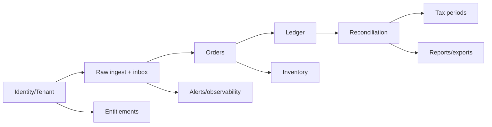

# Product Requirements Document — SànSổ MVP

**Version:** 0.2 · **Date:** 2026-08-24 · **Owner:** Product · **Status:** implementation

## Product thesis — 10 lines

1. SànSổ is a Vietnamese B2B SaaS for evidence-backed commerce operations.
2. It consolidates orders, settlements, fees, refunds, tax evidence and inventory across channels.
3. Every money amount must trace to a canonical transaction and immutable source.
4. Reconciliation explains expected payout versus actual payout line by line.
5. Tax Center prepares and reconciles data; it does not invent tax rules or replace professionals.
6. Versioned deterministic rules preserve historical reproducibility across legal changes.
7. Multi-channel inventory uses a movement ledger, reservations and ATP guards.
8. Operational errors, stale data and missing mappings are visible as actionable exceptions.
9. Human confirmation, preview, diff and audit protect sensitive actions.
10. The pilot outcome is fewer manual spreadsheet hours and more explained discrepancies.

## Goals and metrics

North star: percentage of reconciliation periods completed without unexplained discrepancies.

Supporting measures: time-to-first-reconciliation, exact settlement match rate, value of resolved differences, provenance coverage, sync P50/P95 lag, oversells/1.000 orders, Tax Center completion, activation, MRR/ARR/ARPA, churn/NRR and CAC payback.

## Personas and jobs

| Persona | Pain | Primary job | Permission boundary |
|---|---|---|---|
| Owner / household business | Cannot explain net payout or tax evidence | Understand money received and next action | Billing and organization owner |
| E-commerce Ops | SKU/fee/refund exceptions across shops | Prioritize and resolve operational exceptions | Orders, inventory, integration operations |
| Finance / accountant | Manual cutoff and spreadsheet joins | Lock periods and export traceable evidence | Finance/tax read-review-export |
| Tax/accounting agency | Many isolated clients | Switch only among invited organizations | Time-bound tenant membership |
| Warehouse | Inaccurate ATP and returns | Reserve/release/inspect inventory | No tax/billing visibility by default |
| Internal support | Diagnose sync without broad data access | Time-bound consented support | Masked, reasoned, audited access only |

## Functional requirements

| ID | Requirement | Priority | Acceptance evidence |
|---|---|---|---|
| IAM-01 | Register/login, MFA Owner/Admin, tenant membership and RBAC | MVP | Identity security tests + authenticated E2E |
| IAM-02 | Session rotation/revoke and membership removal invalidation | MVP | Revocation tests |
| ORG-01 | Organization/business/tax profile onboarding | MVP | Profile API/UI/E2E |
| INT-01 | Official connector when authorized; CSV/XLSX fallback always available | MVP | Adapter contract + import E2E |
| INT-02 | Raw input immutable with checksum; inbox/outbox idempotency | MVP | DB constraints + duplicate/out-of-order tests |
| ORD-01 | Canonical order/items/status timeline and source drill-down | MVP | API trace + order detail E2E |
| LED-01 | Append-only signed ledger; correction via reversal/adjustment | MVP | invariant/property tests |
| REC-01 | Settlement bridge, line matching, reason, resolution and audit | MVP | reconciliation E2E |
| TAX-01 | Profile, classification, versioned deterministic rule and exceptions | MVP | golden tests + legal approval gate |
| TAX-02 | Period workflow, snapshot, lock, export and amendment | MVP | state/invariant/E2E tests |
| INV-01 | Product/SKU mapping, inventory ledger, balances and ATP | MVP | concurrency/invariant tests |
| INV-02 | Optional write-back behind flag; stop safely on degraded connection | MVP | contract/retry tests |
| PROF-01 | Profitability bridge including signed fees/refunds/COGS/tax | MVP | arithmetic tests |
| ALT-01 | In-app/email alerts for sync, discrepancy, stock and period | MVP | alert routing tests |
| RPT-01 | Traceable CSV/XLSX export with formula injection protection | MVP | export tests |
| TEAM-01 | Invite/revoke accountant and approval workflow | MVP | permission E2E |
| BILL-01 | Trial/month/year plan and entitlement enforcement | MVP | expiry E2E without data loss |
| ADM-01 | Time-bound consented support access and technical diagnostics | MVP | access/security test |
| AI-01 | AI may explain/summarize/suggest only; never decide tax | P1 | prompt/output policy tests |

## Non-functional requirements

- NFR-SEC: deny-by-default authorization, tenant isolation, encrypted secrets, MFA/step-up, safe upload/webhook/export and tamper-evident audit.
- NFR-DATA: no binary floating point for money; UTC storage; explicit currency/timezone; immutable raw/ledger history; effective-dated rules.
- NFR-REL: 99.9% target; no loss after raw acceptance; retry/DLQ; target RPO ≤15m and RTO ≤4h subject to cost approval.
- NFR-PERF: ordinary interactive API P95 <800ms; heavy exports/reports asynchronous.
- NFR-OBS: correlation ID, masked tenant, attempt/duration/outcome, traces and business-failure alerts.
- NFR-UX: Vietnamese, accessible keyboard/focus/contrast, loading/empty/error/degraded/no-permission states.

## Scope by phase

### MVP — pilot gate

IAM/organization, demo + CSV ingest, orders/ledger/settlement/reconciliation, Tax Center, inventory, dashboard/reports, notifications, team, trial/entitlements and complete demo mode.

### P1

More robust partner connectors, advanced profitability/allocation, accountant bulk workspace, automation rules, AI explanations with evidence citations.

### P2

Additional channels, approved e-filing integrations, enterprise SSO/retention/SLA and advanced forecasting after evidence of demand.

### Non-goals

Automatic legal advice, unsupported tax filing/payment/signature, unapproved stock write-back, LLM-selected tax rates, universal ERP/accounting replacement and premature microservices.

## Dependencies and pilot sequence

Weeks 1–2 foundation; 3–4 ingest/order/ledger; 5–6 reconciliation; 7–8 Tax Center; 9 inventory; 10 reporting/team/billing; 11 security/E2E; 12 pilot hardening. This is a staffing hypothesis, not a delivery guarantee.

## Definition of Done

Each story needs acceptance tests proportionate to risk, tenant authorization, audit for sensitive action, validation/error/UX states, integration observability, migration/rollback if schema changes, documentation, no secret/PII leak, explicit money/rounding, versioned tax basis or out-of-scope marker, and green build/lint/typecheck/tests.
