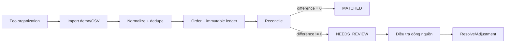
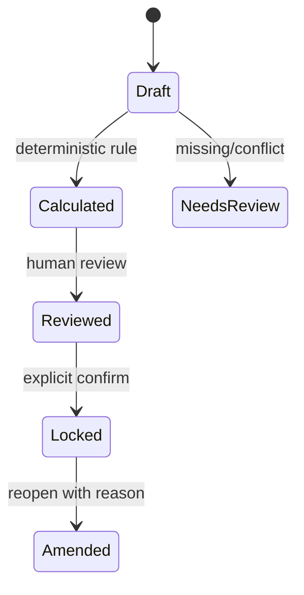
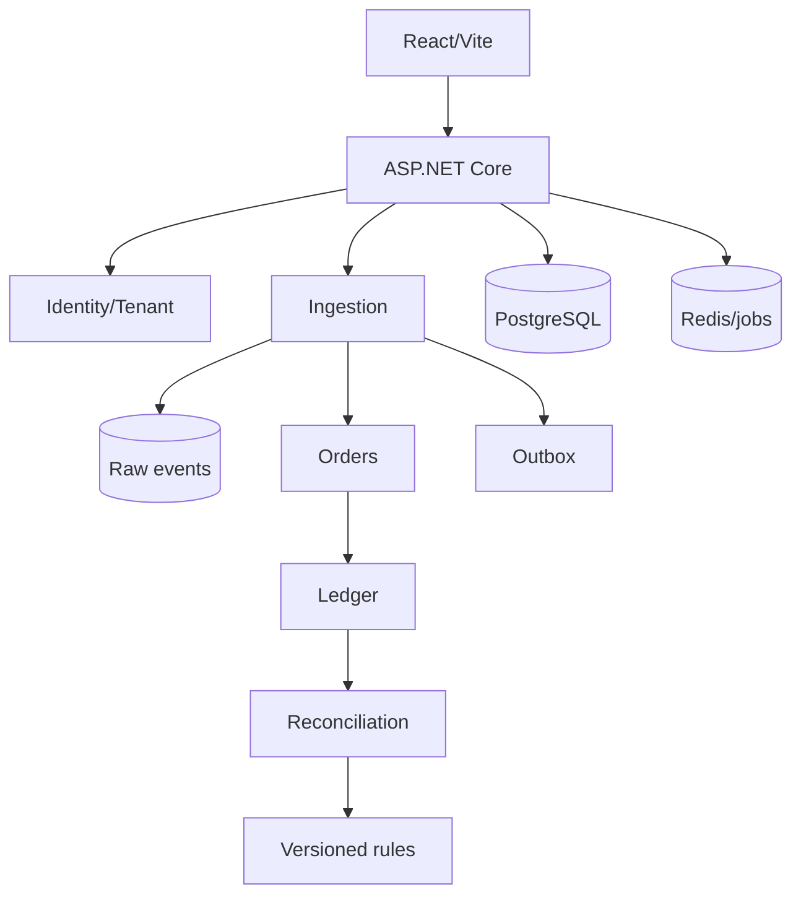
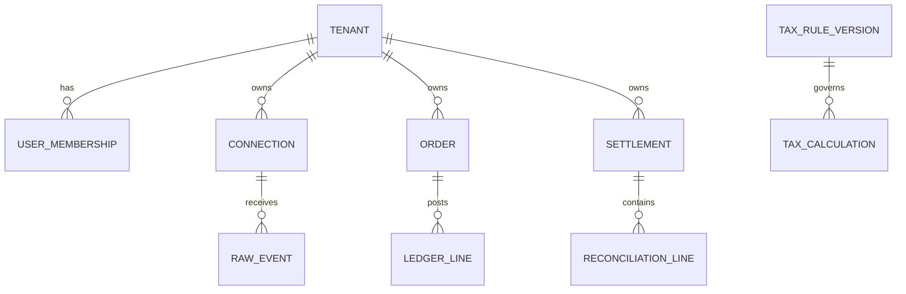

# Product blueprint — SànSổ

`as_of_date: 2026-08-24` · MVP design gate · chưa legal sign-off.

## Executive summary

SànSổ là B2B SaaS giúp hộ/cá nhân kinh doanh và micro-SME hợp nhất đơn, giao dịch, phí, settlement và tồn kho đa kênh. Lát dọc đầu tiên biến dữ liệu demo/CSV thành canonical order và ledger bất biến, đối chiếu expected payout với tiền sàn trả, rồi truy đến từng dòng nguồn. Tax Center chỉ chuẩn bị/đối soát dữ liệu bằng rule có phiên bản; thiếu dữ liệu phải `NEEDS_REVIEW`. North star: tỷ lệ kỳ đối soát hoàn tất không còn chênh lệch chưa giải thích.

## Assumptions và decision log

1. Pilot 8–12 tuần, 10–20 shop, ưu tiên 1.000–20.000 đơn/tháng.
2. Shopee/TikTok production API chưa xác minh; MVP dùng adapter demo/CSV.
3. VND lưu bằng `long`; ngoại tệ tương lai dùng decimal + currency.
4. Tenant isolation áp dụng ở API, query, cache key và test.
5. Ledger append-only; correction tạo reversal/adjustment.
6. PostgreSQL là source of truth; Redis chỉ cache/job coordination.
7. Tax result chỉ publish sau legal/expert approval và golden tests.
8. Không tự submit, ký hoặc nộp tiền trong MVP.
9. “650.000” là giả thuyết, không dùng trong claim/TAM trước khi xác minh.
10. Modular monolith giảm chi phí vận hành sớm.

## Legal applicability matrix

| Vấn đề | Chủ thể | Khi áp dụng | Nguồn/điều khoản | Hiệu lực | Review |
|---|---|---|---|---|---|
| Khấu trừ/khai/nộp thay qua nền tảng | Nền tảng/người bán | Phụ thuộc chức năng đặt hàng, thanh toán, loại giao dịch | URL NĐ 252/2026, NĐ 68/2026, TT 89/2026 trong brief chưa truy xuất/xác minh độc lập được | Chưa xác minh | `LEGAL_REVIEW_REQUIRED` |
| Hóa đơn điện tử | Người bán/nhà cung cấp | Theo chủ thể, doanh thu, giao dịch | Tra văn bản gốc hiện hành trước pilot | Chưa xác minh | `LEGAL_REVIEW_REQUIRED` |
| Dữ liệu cá nhân | Controller/processor tương ứng | Khi xử lý PII, token, dữ liệu tài chính | Data map + pháp luật VN hiện hành | Chưa xác minh | `PRIVACY_REVIEW_REQUIRED` |

Không dùng “tự động nộp thuế 100%”, “đảm bảo đúng thuế”, “thay thế kế toán”, “được cơ quan thuế chứng nhận”. Dùng “Đối soát số thuế sàn báo đã khấu trừ/nộp thay”, “Chuẩn bị dữ liệu hỗ trợ kê khai”, “Kết quả cần chuyên gia xác nhận”.

## Market validation

Chưa có nguồn độc lập đủ tin cậy xác nhận 650.000 là shop, seller hay pháp nhân và thuộc nền tảng/kỳ nào. TAM/SAM/SOM chạy ba kịch bản sau nghiên cứu: Conservative = chủ thể ≥500 đơn/tháng × ARPA thấp; Base = chủ thể đa kênh/có finance ops × ARPA giữa; Upside = thêm agency workspace × ARPA cao. Gate: phỏng vấn 15–30 khách, WTP và số liệu active seller có định nghĩa/kỳ rõ.

## Personas, PRD và scope

MVP phục vụ owner/ops/finance: tạo tenant, demo import idempotent, canonical orders, ledger, settlement reconciliation, drill-down, exception, Tax Center review-only và audit nền tảng. P1: CSV mapping, kỳ khóa/reopen, inventory ledger/ATP, export metadata. P2: connector thật, billing, agency workspace, approved tax rules. Non-goals: tự khai/nộp thuế, stock write-back tự động, AI quyết định thuế suất.

## IA, screens và design

Tổng quan → Đối soát → Sổ giao dịch → Tax Center → Tồn kho → Nguồn dữ liệu → Báo cáo → Cài đặt. Dashboard có freshness/degraded state, money KPIs, settlement waterfall, exception CTA và tax disclaimer. Mọi bảng cần loading/empty/error/no-permission. Tokens: forest `#0e3731`, teal `#1f7668`, amber `#e9b954`, canvas `#f4f7f6`, radius 8–10px, Be Vietnam Pro/system fallback.

## Architecture và ERD

Mọi aggregate có id/tenant/timestamps; raw event có source/event_id/checksum/payload_ref; money row có amount/currency/source_key; tax calculation có snapshot/rule_version/legal_basis/effective_date/status/explanation/reviewer; audit có actor/action/reason/correlation/hash-chain.

## API traceability

| Requirement | API | Module | Data | Test |
|---|---|---|---|---|
| Dashboard | `GET /api/dashboard` | Reporting | ledger/settlement | aggregation |
| Idempotent import | `POST /api/imports/demo` | Ingestion | source_key | reimport invariant |
| Orders | `GET /api/orders` | Orders | order | tenant isolation |
| Explain reconciliation | `GET /api/reconciliations/current` | Reconciliation | ledger lines | difference/explanation |

Production routes derive tenant from verified membership, never a free-form header. Commands use `Idempotency-Key`, lists use cursor pagination, errors use RFC 7807.

## Events, tax rules, security, tests

Events: `RawEventAccepted`, `OrderUpserted`, `SettlementImported`, `TaxPeriodRequested`, `InventoryMovementPosted`; jobs persist attempt/duration/outcome and use retry + DLQ. Tax rule fields: version, subject, channel, category, effective range, legal source, formula DSL, rounding, required inputs, approval. Không nhúng sample rate chưa xác minh; missing/overlap → `NEEDS_REVIEW`.

Threats: tenant IDOR, stolen token, webhook replay, CSV formula, PII leakage, unauthorized export, tax-rule tampering. Controls: deny-by-default RBAC/ABAC, tenant isolation tests, encrypted vault, signature/timestamp/nonce, file scan/cell escaping, log redaction, step-up auth, append-only audit, four-eyes publishing, time-bound support.

Tests: signed money/rounding; golden effective-date/refund/missing input; PostgreSQL transaction/inbox/outbox/isolation; connector duplicate/out-of-order/rate-limit/schema drift; E2E onboarding→reconciliation, exception resolution, Tax Center review→lock→export. Invariants: duplicate has no second effect, reversal preserves history, locked period immutable, same snapshot+rule version gives same result.

SLO targets: 99.9%, interactive P95 <800ms, RPO ≤15m, RTO ≤4h subject to cost. Alert ingest lag, queue depth, reconciliation/tax/stock failures. Runbooks: revoked token, outage, backlog, bad rule, stock push and restore.

## Pricing, pilot, risks và backlog

Starter/Growth/Pro/Agency chỉ là pricing hypotheses, cần 15–30 interviews và Van Westendorp. Pilot đo thời gian đối soát, tỷ lệ chênh lệch được giải thích, lỗi SKU/stock. Rủi ro chính và owner: legal change/Legal, API unavailable/Integration, money error/Finance, tenant leak/Security, stock write/Ops, low WTP/Product, support cost/CS.

Backlog: P0 tenant auth [M], raw/inbox [M], CSV preview [M], order+ledger [L], reconciliation [L], dashboard [M], audit [M]; P1 period lock [M], Tax Center skeleton [L], inventory/ATP [L], export [M]; P2 connectors [XL], billing [L], agency [L].
