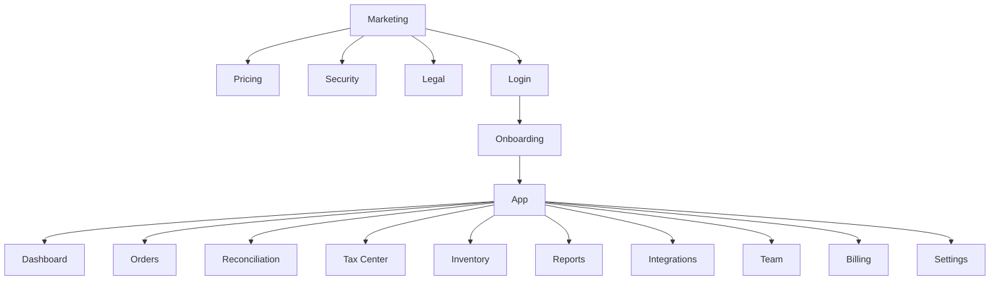
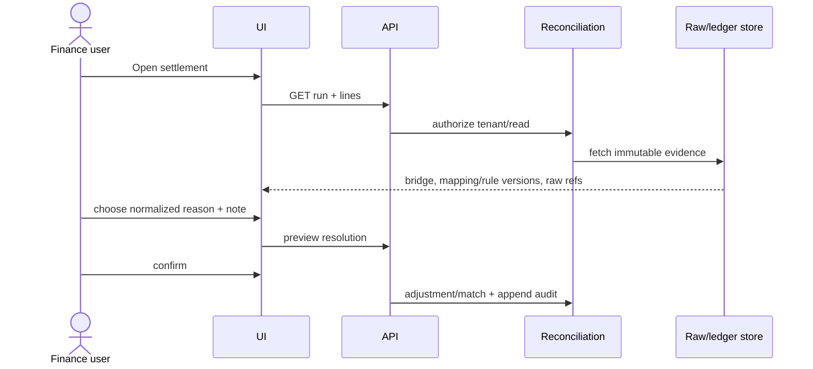

# Information architecture, screen and content specification

## Sitemap

## Screen specifications

| Screen | Primary information | Primary action | Critical states |
|---|---|---|---|
| Marketing | Value, evidence, supported/fallback integration, disclaimer | Start trial | No unsupported legal/integration claim |
| Register/login | Identity, password, MFA | Create/login | lockout, MFA required, session revoked |
| Onboarding | organization, business/tax profile, channel/import | Complete first import | incomplete profile, demo option |
| Dashboard | freshness, money KPIs, exceptions, tax/inventory health | Investigate discrepancy | loading/error/degraded/empty |
| Orders | canonical order, status timeline, source | Open order/raw source | duplicate/missing mapping |
| Reconciliation | GMV bridge, expected/actual lines, evidence | Resolve/escalate | matched/unmatched/locked |
| Tax Center | period checklist, rules, evidence, withholding difference | Review/lock/export | needs review/no approved rule |
| Inventory | SKU map, on-hand/reserved/quarantine/ATP, movements | Map/reserve/adjust | conflict/negative/degraded write-back |
| Reports | saved reports and provenance metadata | Generate/export | async progress/expired entitlement |
| Integrations | capability, cursor, lag, token and errors | Connect/re-auth/import | rate limit/schema drift/revoked |
| Team | role, tenant, expiry, last access | Invite/revoke | no-permission/step-up |
| Billing | plan, usage, trial, invoices | Change plan | step-up/past due/read-only |
| Admin | masked health and consented support sessions | Request access | consent missing/expired/audited |

## Reconciliation investigation journey

## Required UI states

- Loading uses skeleton/progress and never displays zero as unknown.
- Empty distinguishes no source, no records in filter and no exceptions.
- Error supplies correlation ID and safe recovery, never raw stack/PII.
- Degraded shows affected source, last success, freshness, disabled write-back and re-auth/retry action.
- No-permission explains needed role without revealing protected data.
- Locked shows snapshot/version and requires amendment/reopen reason.
- Async shows queued/running/retry/completed/failed with safe cancel when supported.

## Design tokens

| Token | Value | Usage |
|---|---|---|
| color.forest.900 | `#0e3731` | navigation/header |
| color.teal.600 | `#1f7668` | primary/status healthy |
| color.amber.500 | `#e9b954` | review/warning |
| color.canvas | `#f4f7f6` | application background |
| color.danger | `#a14b3b` | destructive/error only |
| radius.sm/md | `8px / 10px` | controls/cards |
| focus.ring | `2px #2e8d7c + 2px offset` | keyboard focus |
| font.ui | Be Vietnam Pro, system sans | Vietnamese UI |

Do not use color alone for status. Minimum target contrast WCAG AA; 44×44px touch target; table headers/controls have accessible names; money columns right-align and retain sign.

## Component inventory

AppShell, TenantSwitcher, PermissionGate, DataFreshness, HealthBadge, MoneyCard, SettlementBridge, EvidenceDrawer, ExceptionQueue, TaxPeriodStepper, RuleVersionBadge, InventoryBalance, MovementTimeline, CsvImportWizard, ExportJob, AlertCenter, PlanUsage, AuditTimeline, EmptyState, ErrorState, DegradedState, NoPermissionState and ConfirmDiffDialog.

## Vietnamese microcopy

| Context | Copy |
|---|---|
| Tax missing input | “Chưa đủ dữ liệu để tính. SànSổ không tự đoán; vui lòng bổ sung hồ sơ hoặc ngành hàng.” |
| Platform withholding | “Số sàn báo đã khấu trừ/nộp thay; cần đối chiếu với chứng từ và rule áp dụng.” |
| Lock | “Sau khi khóa, dữ liệu kỳ không thể sửa trực tiếp. Điều chỉnh mới sẽ tạo amendment có dấu vết.” |
| Reopen | “Nhập lý do mở lại kỳ. Báo cáo đã xuất vẫn giữ nguyên phiên bản.” |
| Degraded | “Kết nối đang suy giảm. Dữ liệu đã tiếp nhận được giữ an toàn; stock write-back đã tạm dừng.” |
| Expired | “Đồng bộ mới đã dừng theo gói. Dữ liệu hiện có vẫn xem và xuất theo quyền của bạn.” |
| Disclaimer | “SànSổ hỗ trợ chuẩn bị và đối soát dữ liệu; không thay thế tư vấn của chuyên gia thuế.” |
